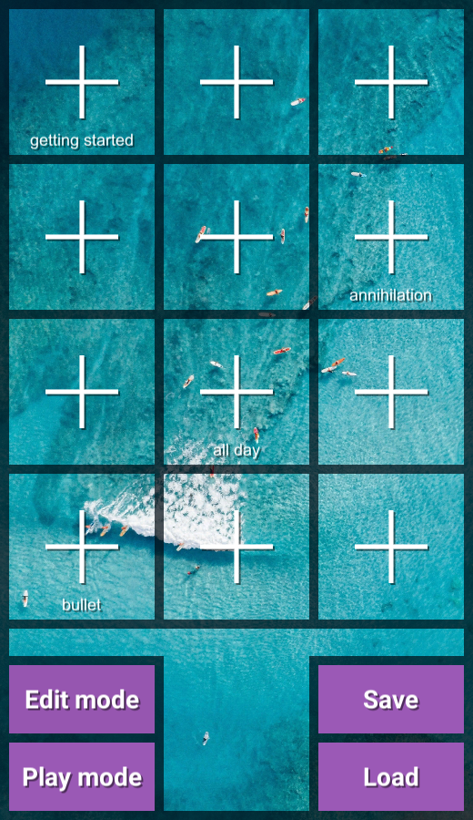
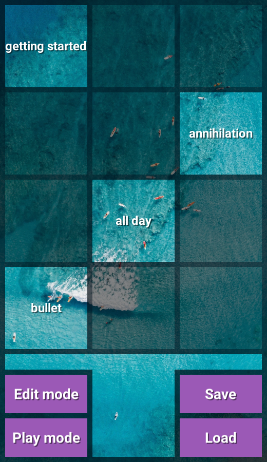
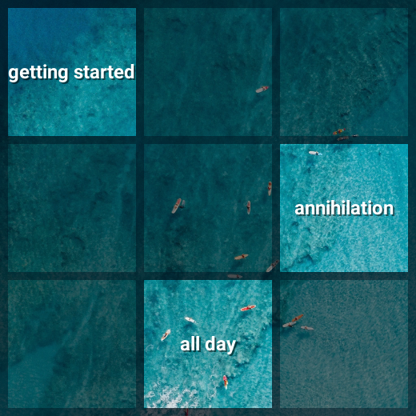
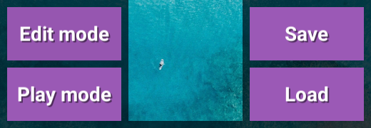
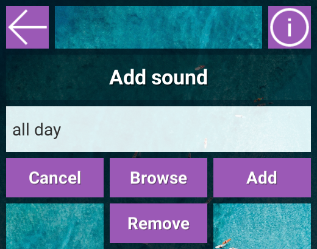
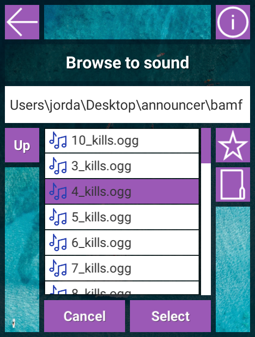
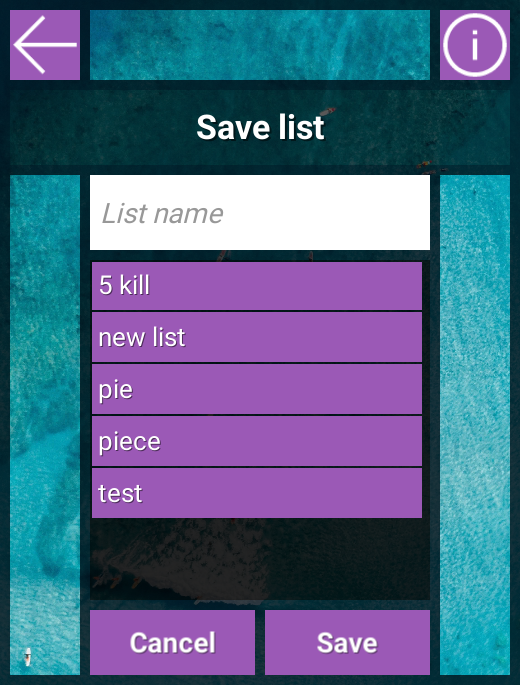
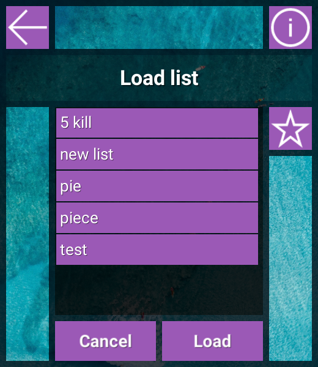
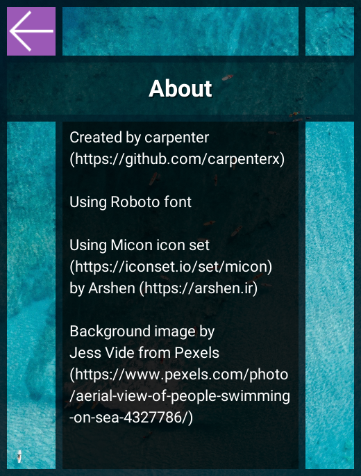

# Soundbox
A simple application that allows the playing of external sound files (ogg, wav, aif)

## Instructions

### Start screen
#### Soundbox start screen in edit mode

#### Soundbox start screen in play mode

#### Adding sounds

* Click the add buttons to go to the [add screen](#add-screen) and assign a sound to the clicked tile

#### Playing sounds

* Click on a named tile to play its sound

#### Navigation

* Click the "Edit mode" and "Play mode" buttons to switch between edit mode and play mode
* Click the "Save" button to go to the [save screen](#save-screen)
* Click the "Load" button to go to the [load screen](#load-screen)

### Add screen

* Click the back arrow or "Cancel" to go back to the [start screen](#start-screen)
* Click the info icon to go to the [about screen](#about-screen)
* Enter text into the input field to set the name of the sound. By default, the name will be the same as the file name (extension included)
* Click "Browse" to open the [browse screen](#browse-screen) and select a sound file
* Click "Add" to add the currently selected sound to the clicked selected sound tile. This button can also be used to rename the sound tile without changing the selected sound
* Click "Remove" to remove the current sound from the sound tile

### Browse screen

* Click the back arrow or "Cancel" to go back to the [add screen](#add-screen)
* Click the info icon to go to the [about screen](#about-screen)
* Click the "Up" button to go up a folder, if possible
* Click the star icon to remember the current folder
* Click the folder icon to go to the last remembered folder
* Click "Select" with a folder selected to open it
* Click "Select" with a sound file selected to select it and go back to the [add screen](#add-screen)

### Save screen

* Click the back arrow or "Cancel" to go back to the [start screen](#start-screen)
* Click the info icon to go to the [about screen](#about-screen)
* Enter a name for the desired list name in the input field
* Click "Save" to save the current sounds with the selected name. __If the file already exists, it will get overwritten__

### Load screen

* Click the back arrow or "Cancel" to go back to the [start screen](#start-screen)
* Click the info icon to go to the [about screen](#about-screen)
* Click "Load" to load the currently selected sound list

### About screen

* Click the back arrow  to go back to the previous screen
